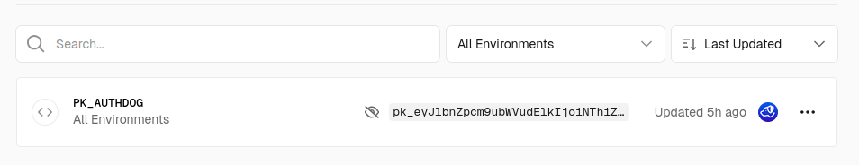

# Authdog next app-router demo

## Get started

- `npm i`
- `npm run dev`

## Configure vercel

- Add `PK_AUTHDOG` to your project environments



Then you can use PK_AUTHDOG from the SDK to authenticate your requests:

```typescript
import { NextRequest } from "next/server";
import { useAuthMiddleware } from "@authdog/nextjs-app/dist/index.server";

export async function middleware(request: NextRequest): Promise<Response> {
  return useAuthMiddleware(process.env.PK_AUTHDOG)(request);
}
...
```
